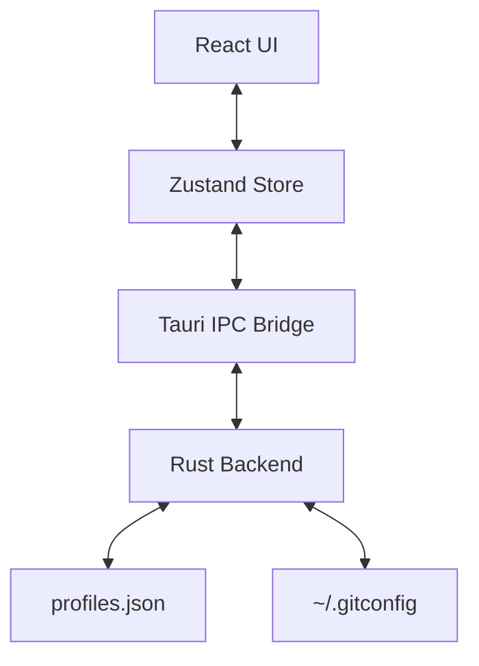

# GitSwitch Architecture 🏗️

This document outlines the technical architecture of GitSwitch, detailng the interaction between the Rust backend and the React frontend.

## 📐 System Overview

GitSwitch follows a standard Tauri architecture: A **Rust backend** handles file system operations, Git configuration, and security-sensitive tasks (like SSH key management), while a **React frontend** provides the user interface.



## 🦀 Backend (Rust)

The backend is structured into modular components:

### 1. Models (`src-tauri/src/models.rs`)

Defines the core data structures used throughout the app.

- `Profile`: Representation of a Git identity (ID, label, name, email, color, etc.).
- `Config`: The root configuration object containing the list of profiles and app settings.

### 2. Config Store (`src-tauri/src/config/store.rs`)

Handles persistence.

- Uses the `tauri-plugin-store` (conceptually) or manual JSON serialization to save profiles to the system appropriate AppData folder.
- **Location:** Typically `%APPDATA%/com.gitswitch.app/profiles.json` on Windows.

### 3. IPC Commands (`src-tauri/src/commands/profiles.rs`)

Exposes functions to the frontend via Tauri's `invoke` system.

- `get_config`: Retrieves the current configuration/profiles.
- `save_profile`: Adds or updates a profile.
- `delete_profile`: Removes a profile.
- `switch_profile`: The core logic that updates the global `.gitconfig`.

## ⚛️ Frontend (React)

### 1. State Management (`src/stores/useProfileStore.ts`)

Uses **Zustand** to manage local state and synchronize with the backend.

- It acts as the "Single Source of Truth" for the UI.
- On initialization, it calls `get_config` from Rust.
- Actions (like `addProfile`, `switchProfile`) call the corresponding Rust commands and update the local state upon success.

### 2. Design System (`src/styles/`)

- Uses CSS Variables for theme consistency.
- Dark-mode first aesthetics.

## 💾 Data Schema (`profiles.json`)

```json
{
  "profiles": [
    {
      "id": "uuid-1",
      "label": "Personal",
      "name": "Jane Doe",
      "email": "jane@personal.me",
      "color": "#7C3AED",
      "sshKeyPath": null,
      "isDefault": true
    }
  ],
  "settings": {
    "autoSwitch": true,
    "theme": "dark"
  }
}
```

## 🔒 Security Considerations

- **SSH Keys:** The app only stores paths to SSH keys, never the private key content itself.
- **Git Config:** All writes to `.gitconfig` are performed via Rust to ensure atomic operations and prevent corruption.

## Recent changes (Mar 16, 2026)

- **Active profile persistence:** `AppConfig` now includes an `active_profile_id` field. The backend exposes commands to get/set the active profile so the frontend can display and keep in sync with the global Git identity.
- **Directory rules model & commands:** `DirectoryRule` objects now include a stable `id` and the backend implements `get_directory_rules`, `add_directory_rule`, `update_directory_rule`, and `delete_directory_rule` commands. The frontend store (`useProfileStore`) consumes these commands to provide CRUD UI for rules.
- **Error serialization/normalization:** Backend errors are serialized as structured JSON; the frontend includes a robust normalizer to display friendly messages rather than raw serialized strings.
