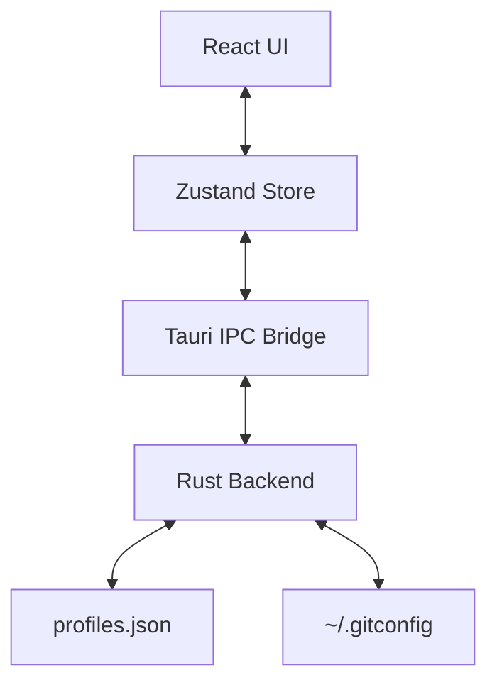

# GitSwitch Architecture 🏗️

This document outlines the technical architecture of GitSwitch, detailng the interaction between the Rust backend and the React frontend.

## 📐 System Overview

GitSwitch follows a standard Tauri architecture: A **Rust backend** handles file system operations, Git configuration, and security-sensitive tasks (like SSH key management), while a **React frontend** provides the user interface.


```mermaid
graph TD
    UI[React UI] <--> Store[Zustand Store]
    Store <--> IPC[Tauri IPC Bridge]
    IPC <--> Rust[Rust Backend]
    Rust <--> Config[profiles.json]
    Rust <--> Git[~/.gitconfig]
```

## 🦀 Backend (Rust)

The backend is structured into modular components:

### 1. Models (`src-tauri/src/models.rs`)
Defines the core data structures used throughout the app.
- `Profile`: Representation of a Git identity (ID, label, name, email, color, etc.).
- `Config`: The root configuration object containing the list of profiles and app settings.

### 2. Config Store (`src-tauri/src/config/store.rs`)
Handles persistence.
- Uses the `tauri-plugin-store` (conceptually) or manual JSON serialization to save profiles to the system appropriate AppData folder.
- **Location:** Typically `%APPDATA%/com.gitswitch.app/profiles.json` on Windows.

### 3. IPC Commands (`src-tauri/src/commands/profiles.rs`)
Exposes functions to the frontend via Tauri's `invoke` system.
- `get_profiles`, `add_profile`, `update_profile`, `delete_profile`: profile CRUD.
- `switch_profile_globally` / `apply_identity`: write `user.*` and signing settings to the global `.gitconfig` (shared helper `git::apply_identity_globally`).
- `detect_identities`: reads the identity git currently resolves, plus a default SSH key in `~/.ssh`.
- `get_directory_rules`, `add_directory_rule`, `remove_directory_rule`, `preview_directory`: directory rules (see below).
- `generate_ssh_key`, `list_ssh_keys`, `read_public_key`, `apply_ssh_alias`, `test_ssh_connection`: SSH key handling (see below).

All commands return `Result<_, BackendError>`. `BackendError` (`errors.rs`) serializes as `{ kind, message, hint?, details? }`; the frontend normalizes it with `normalizeBackendError` in `src/utils/error.ts`. Every `git` call goes through `src-tauri/src/git.rs`.

### 4. Directory rules (`identity.rs`, `commands/rules.rs`)
A rule maps a folder to a profile. For each referenced profile GitSwitch writes `<app config dir>/identities/<profileId>.gitconfig` (`user.*`, `commit.gpgsign`, and `core.sshCommand` when the profile has a key) and keeps one managed block at the end of the global gitconfig:

```
# >>> gitswitch:directory-rules >>>
[includeIf "gitdir/i:C:/Users/me/work/"]
    path = "C:/Users/me/AppData/Roaming/.../identities/<id>.gitconfig"
# <<< gitswitch:directory-rules <<<
```
Git then applies the identity to any repository below the folder. Content outside the markers is never touched (`managed_block.rs`), the first edit makes a `.gitswitch.bak` copy, and the global file honors `GIT_CONFIG_GLOBAL`. Turning `autoSwitch` off removes the block. Deleting a profile removes its rules.

### 5. SSH (`ssh.rs`, `commands/ssh.rs`)
Shells out to `ssh-keygen` (ed25519, never overwrites an existing key) and `ssh`. `apply_ssh_alias` writes a per-profile `Host` block (`HostName`, `IdentityFile`, `IdentitiesOnly yes`) to `~/.ssh/config`, using the same managed-block mechanism. The block is refreshed when the profile is edited and removed when it is deleted.

## ⚛️ Frontend (React)

### 1. State Management (`src/stores/useProfileStore.ts`)
Uses **Zustand** to manage local state and synchronize with the backend.
- It acts as the "Single Source of Truth" for the UI.
- On initialization, it calls `get_config` from Rust.
- Actions (like `addProfile`, `switchProfile`) call the corresponding Rust commands and update the local state upon success.

### 2. Design System (`src/styles/`)
- Uses CSS Variables for theme consistency.
- Dark-mode first aesthetics.

## 💾 Data Schema (`profiles.json`)

```json
{
  "profiles": [
    {
      "id": "uuid-1",
      "label": "Personal",
      "name": "Jane Doe",
      "email": "jane@personal.me",
      "color": "#7C3AED",
      "sshKeyPath": null,
      "isDefault": true
    }
  ],
  "settings": {
    "autoSwitch": true,
    "theme": "dark"
  }
}
```

## 🔒 Security Considerations
- **SSH Keys:** The app only stores paths to SSH keys, never the private key content itself.
- **Git Config:** All writes to `.gitconfig` are performed via Rust to ensure atomic operations and prevent corruption.
